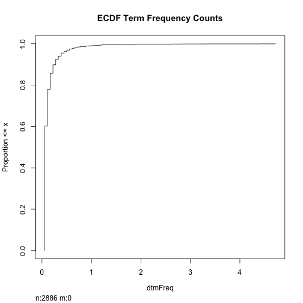

<!--Import Bootstrap and jquery-->
  <link href="css/bootstrap.min.css" rel="stylesheet" media="screen">
  <link href="css/bootstrap.fluidlayout.css" rel="stylesheet" media="screen">
  <script src="http://code.jquery.com/jquery-latest.js"></script>
  <script src="js/bootstrap.min.js"></script>  


<!-- Stuff for Rcharts -->
  <link rel='stylesheet' href='../rCharts/nvd3/css/nv.d3.css'>
  <link rel='stylesheet' href='../rCharts/nvd3/css/rNVD3.css'>
  <script src='../rCharts/nvd3/js/jquery-1.8.2.min.js' type='text/javascript'></script>
  <script src='../rCharts/nvd3/js/d3.v2.min.js' type='text/javascript'></script>
  <script src='../rCharts/nvd3/js/nv.d3.js' type='text/javascript'></script>
  <script src='../rCharts/nvd3/js/fisheye.js' type='text/javascript'></script>


```
## Loading required package: splines
```

```
## Hmisc library by Frank E Harrell Jr
## 
## Type library(help='Hmisc'), ?Overview, or ?Hmisc.Overview') to see overall
## documentation.
```

```
## Attaching package: 'Hmisc'
```

```
## The following object is masked from 'package:survival':
## 
## untangle.specials
```

```
## The following object is masked from 'package:base':
## 
## format.pval, round.POSIXt, trunc.POSIXt, units
```


<!--Top of page NavBar-->
<div class="navbar navbar-fixed-top">
  <div class="navbar-inner">
    <a class="brand" href="http://royaltyAnalytics.com">Royalty Analytics</a>
    <ul class="nav">
      <li><a href="#introduction">Introduction</a></li>
      <li><a href="#DataSummary">Data Summary</a></li>
      <li><a href="#Analysis">Analysis</a></li>
      <li><a href="#Results">Results</a></li>
    </ul>
  </div>
</div>


<div class="container">

<div class="row-fluid">

<div class="span12">

<div></div>

<h1>The Greatest Lead List Generation Tool recommendation system analysis.</h1>
<hr>


<h2>Authors</h2>


<h3>Theodore Van Rooy on Behalf of Royalty Analytics</h3>
  
<div class="leaderboard">

  <a name="introduction"></a>
  
  <h1>Introduction</h1>
  
  <p>Royalty Analytics wants to make better recommendations for it's client's business 2 business sales.  This analysis shows how effective the proposed algorithm is.<p>
</div>  

<a name="DataSummary"></a>

Data Summary
------------------------

### Data Head

We will be using data drawn out of Royalty Analytics Lead Generation tool.  The data consists of a number of self selected leads which are then crawled, and cleaned.   

The following is the head of a table giving lead information.

<table class="table table-striped"><thead><tr><th> Row </th><th> Name </th><th> Address </th></tr></thead><tr><td> 1 </td><td> BlackPaw </td><td> 459 South McCaslin Boulevard #4, Louisville, CO, United States </td></tr><tr><td> 2 </td><td> Camp Bow Wow </td><td> 1705 West 10th Avenue, Broomfield, CO, United States </td></tr><tr><td> 3 </td><td> Milgard Windows &amp; Doors </td><td> 17450 East 32nd Place, Aurora, CO, United States </td></tr><tr><td> 4 </td><td> Nissi's </td><td> 2675 Northpark Drive, Lafayette, CO, United States </td></tr><tr><td> 5 </td><td> Denver SEO </td><td> 605 Parfet Street #202, Lakewood, CO, United States </td></tr><tr><td> 6 </td><td> Hain Celestial Group </td><td> 4600 Sleepytime Drive, Boulder, CO, United States </td></tr></table>


###  Leads by City

Lets take a quick look at leads by city, with a sweet plot.


<div id='leadsCity' class='rChart nvd3'></div>
<script type='text/javascript'>
 $(document).ready(function(){
      drawleadsCity()
    });
    function drawleadsCity(){  
      var opts = {
 "dom": "leadsCity",
"width":    800,
"height":    400,
"x": "city",
"y": "freq",
"type": "multiBarChart",
"id": "leadsCity" 
},
        data = [
 {
 "city": " Aurora",
"freq": 2 
},
{
 "city": " Boulder",
"freq": 1 
},
{
 "city": " Broomfield",
"freq": 2 
},
{
 "city": " Channelview",
"freq": 1 
},
{
 "city": " Denver",
"freq": 5 
},
{
 "city": " Houston",
"freq": 5 
},
{
 "city": " Lafayette",
"freq": 1 
},
{
 "city": " Lakewood",
"freq": 1 
},
{
 "city": " Longmont",
"freq": 1 
},
{
 "city": " Louisville",
"freq": 4 
} 
]
  
      var data = d3.nest()
        .key(function(d){
          return opts.group === undefined ? 'main' : d[opts.group]
        })
        .entries(data)
      
      nv.addGraph(function() {
        var chart = nv.models[opts.type]()
          .x(function(d) { return d[opts.x] })
          .y(function(d) { return d[opts.y] })
          .width(opts.width)
          .height(opts.height)
         
        
          
        

        
        
        
      
       d3.select("#" + opts.id)
        .append('svg')
        .datum(data)
        .transition().duration(500)
        .call(chart);

       nv.utils.windowResize(chart.update);
       return chart;
      });
    };
</script>


###  Fetched Data

Fetching the dataset in parallel:


```
## [[1]]
##  [1] "XML"       "tm"        "RCurl"     "bitops"    "methods"  
##  [6] "stats"     "graphics"  "grDevices" "utils"     "datasets" 
## [11] "base"     
## 
## [[2]]
##  [1] "XML"       "tm"        "RCurl"     "bitops"    "methods"  
##  [6] "stats"     "graphics"  "grDevices" "utils"     "datasets" 
## [11] "base"
```

```
## Time to fetch and process pages on single processor: 12.24
```

```
## Time to fetch and process pages on two processors: 5.676
```


Twice as fast when running on 2 cores!  


<a name="Analysis"></a>

Analysis
------------------------

To complete this analysis we looked at some word frequency counts:


 


####  ECDF Term Frequency Counts


<div id='termFreq' class='rChart nvd3'></div>
<script type='text/javascript'>
 $(document).ready(function(){
      drawtermFreq()
    });
    function drawtermFreq(){  
      var opts = {
 "dom": "termFreq",
"width":    800,
"height":    400,
"x": "monoGramTermFreq",
"y": "cdf",
"type": "lineChart",
"id": "termFreq" 
},
        data = [
 {
 "monoGramTermFreq": 0.055556,
"cdf":      0 
},
{
 "monoGramTermFreq": 0.055556,
"cdf": 0.60187 
},
{
 "monoGramTermFreq": 0.11111,
"cdf": 0.77963 
},
{
 "monoGramTermFreq": 0.16667,
"cdf": 0.85655 
},
{
 "monoGramTermFreq": 0.22222,
"cdf": 0.89848 
},
{
 "monoGramTermFreq": 0.27778,
"cdf": 0.9255 
},
{
 "monoGramTermFreq": 0.33333,
"cdf": 0.94006 
},
{
 "monoGramTermFreq": 0.38889,
"cdf": 0.95495 
},
{
 "monoGramTermFreq": 0.44444,
"cdf": 0.96223 
},
{
 "monoGramTermFreq":    0.5,
"cdf": 0.96951 
},
{
 "monoGramTermFreq": 0.55556,
"cdf": 0.97471 
},
{
 "monoGramTermFreq": 0.61111,
"cdf": 0.97852 
},
{
 "monoGramTermFreq": 0.66667,
"cdf": 0.98233 
},
{
 "monoGramTermFreq": 0.72222,
"cdf": 0.98475 
},
{
 "monoGramTermFreq": 0.77778,
"cdf": 0.98683 
},
{
 "monoGramTermFreq": 0.88889,
"cdf": 0.98891 
},
{
 "monoGramTermFreq": 0.94444,
"cdf": 0.98995 
},
{
 "monoGramTermFreq":      1,
"cdf": 0.99099 
},
{
 "monoGramTermFreq": 1.0556,
"cdf": 0.99134 
},
{
 "monoGramTermFreq": 1.1111,
"cdf": 0.99272 
},
{
 "monoGramTermFreq": 1.1667,
"cdf": 0.99342 
},
{
 "monoGramTermFreq": 1.2222,
"cdf": 0.99515 
},
{
 "monoGramTermFreq": 1.3333,
"cdf": 0.99584 
},
{
 "monoGramTermFreq":    1.5,
"cdf": 0.99653 
},
{
 "monoGramTermFreq": 1.6111,
"cdf": 0.99723 
},
{
 "monoGramTermFreq": 1.6667,
"cdf": 0.99757 
},
{
 "monoGramTermFreq": 1.8333,
"cdf": 0.99792 
},
{
 "monoGramTermFreq": 1.8889,
"cdf": 0.99827 
},
{
 "monoGramTermFreq": 2.6111,
"cdf": 0.99861 
},
{
 "monoGramTermFreq": 2.8333,
"cdf": 0.99896 
},
{
 "monoGramTermFreq": 3.2222,
"cdf": 0.99931 
},
{
 "monoGramTermFreq": 4.3889,
"cdf": 0.99965 
},
{
 "monoGramTermFreq": 4.7222,
"cdf":      1 
} 
]
  
      var data = d3.nest()
        .key(function(d){
          return opts.group === undefined ? 'main' : d[opts.group]
        })
        .entries(data)
      
      nv.addGraph(function() {
        var chart = nv.models[opts.type]()
          .x(function(d) { return d[opts.x] })
          .y(function(d) { return d[opts.y] })
          .width(opts.width)
          .height(opts.height)
         
        
          
        

        
        
        
      
       d3.select("#" + opts.id)
        .append('svg')
        .datum(data)
        .transition().duration(500)
        .call(chart);

       nv.utils.windowResize(chart.update);
       return chart;
      });
    };
</script>


We can see both the default R plot and the nvD3 plot here... like the nvD3 plot much better.

This tells us that very few of the words are used with a frequency greater than 1 per document, and a lot of them are used less than 70% of the time.  Let's use the intrestesting ones in the 70%-100% range.

<table class="table table-striped"><thead><tr><th> Rank </th><th> keyword </th><th> frequency </th></tr></thead><tr><td> 1 </td><td> control </td><td> 0.944444444444444 </td></tr><tr><td> 2 </td><td> for </td><td> 0.944444444444444 </td></tr><tr><td> 3 </td><td> oilfield </td><td> 0.944444444444444 </td></tr><tr><td> 4 </td><td> all </td><td> 0.888888888888889 </td></tr><tr><td> 5 </td><td> marketing </td><td> 0.888888888888889 </td></tr><tr><td> 6 </td><td> new </td><td> 0.888888888888889 </td></tr></table>


<a name="Results"></a>

Results
------------------------

### How Good are our selected words?

Using our simple list of terms found on the front page of the websites, lets poll Google Places and see what kinds of results we get back.


```
##  [1] "Baker Hughes"                      
##  [2] "National Oilwell Varco"            
##  [3] "Stallion Production Services"      
##  [4] "Ward Leonard Electric Co Inc"      
##  [5] "National Oilwell Varco"            
##  [6] "Lufkin Industries Inc."            
##  [7] "National Oilwell Varco"            
##  [8] "Cameron Inc"                       
##  [9] "M-I Swaco"                         
## [10] "Parker Systems Inc"                
## [11] "Team Industrial Services Inc"      
## [12] "J V S Engineers"                   
## [13] "H & M Pipe Beveling Machine Co"    
## [14] "Weatherford"                       
## [15] "Westerman Co"                      
## [16] "Schlumberger"                      
## [17] "Baker Hughes Inc"                  
## [18] "Toyota of Huntington Beach"        
## [19] "Fox Valley Volkswagen"             
## [20] "Newpark Environmental Services LLC"
```


Okay so the algorithm might need some more work...

</div>
</div>
</div>
